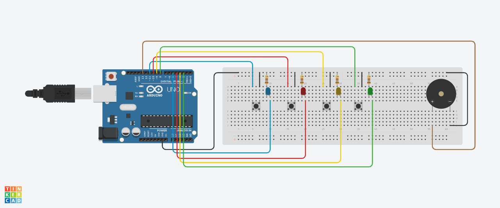

# jogo-genius
Jogo da memória com cores e sons feito com componentes eletrônicos e Arduino Uno.

## Componentes utilizados:
- 1 Buzzer passivo 5V;
- 1 LED difuso 5mm vermelho;
- 1 LED difuso 5mm azul;
- 1 LED difuso 5mm amarelo;
- 1 LED difuso 5mm branco;
- 5 Push buttons chave táctil 12x12;
- 5 Capas coloridas para push button;
- 1 Protoboard 800 furos;
- 1 Arduino Uno.

Esquemático do circuito:

